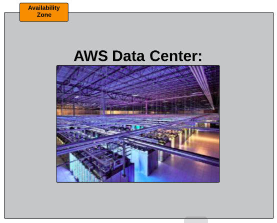

##### [Index](README.md)

---

##### Networking Services and Connectivity

- AWS Global(physical) Infrastructure

- AWS Regions:
  - A grouping of AWS resources located in a specified geographical location.
  - Designed to service AWS customers that are located closest to a region.
  - Comprised of multiple `Availability Zones`.
  - Availability Zones(AZs) are where separate, physical AWS data centers are located.
  - Multiple AZs in each region provide redundancy for AWS resources in that `region`.
  
  - 
  - 
  - 
   
  
---

##### Virtual Private Cloud (VPC)

- It is a private subsection of AWS that you can control, into which you can place AWS resources (such as EC2 instances and databases).
  - You have full control over who has access to the AWS resources that you place inside your VPC.
  
- VPC lets you provision a `logically isolated` section of the Amazon Web Services(AWS) cloud where you can launch AWS resources in a `virtual network` that you define.
  - You have complete control over your virtual networking environment, including selection of your own `IP address range`, creation of `subnets` and configuration of `route tables` and `network gateways`.
  
- When we create AWS account, a default `VPC` is created for us. Which includes the standard components that are needed to make it functional:
  - Internet Gateway (IGW)
  - A route table (with predefined routes to the default subnets)
  - A `Network Access Control List` (with predefined rules for access like a firewall)
  - Subnets to provision AWS resources in(such as EC2 instances)

- 

---

##### Internet Gateways (IGW)

- A combination of hardware and software that provides private network with a route to the world outside(internet) of the VPC.
- TGW is a horizontally scaled, redundant and higly available VPC component that allows communication between instances in our VPC and the internet.
  - It therefore imposes no availability risks or bandwidth constraints on our network traffic.

- Default VPC already has an IGW attached.

- Route tables rules and details:
  - Only 1 IGW can be attached to a VPC at a time.
  - An IGW cannot be detached from a VPC while there are active AWS resources in the VPC(EC2, RDS etc.,)
  
- [ref](https://docs.aws.amazon.com/vpc/latest/userguide/VPC_Internet_Gateway.html)

---

##### Route Tables (RTs)

- A route table contains a `set of rules`, called `routes`, that are used to determine where `network traffic is directed`.
- Default VPC already has a main route table.
- Routes table rules and details:
  - We can have multiple active route tables in a VPC.
  - You cannot delete a route table if it has dependencies (associated subnets)
  

---

##### Network Access Control List (NACLs)  
